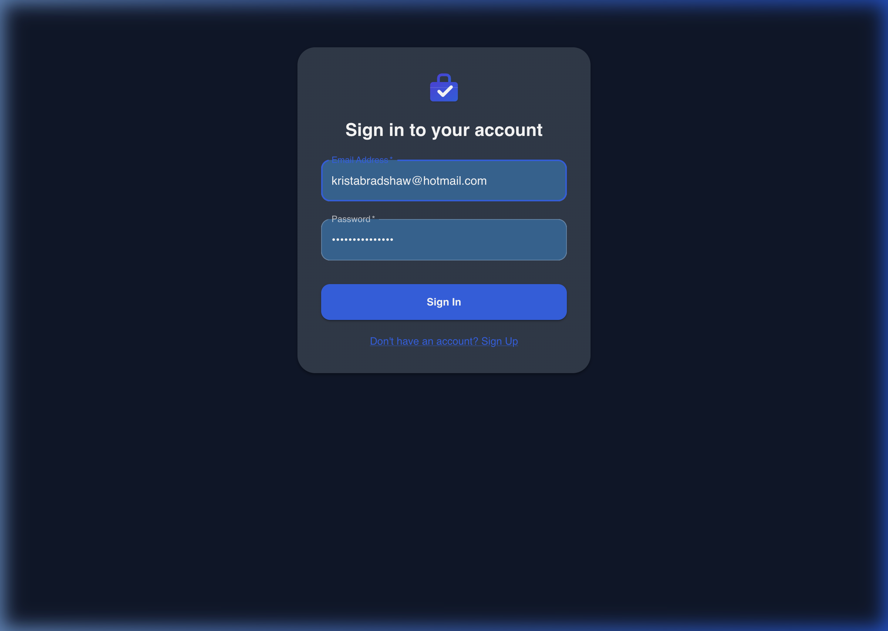
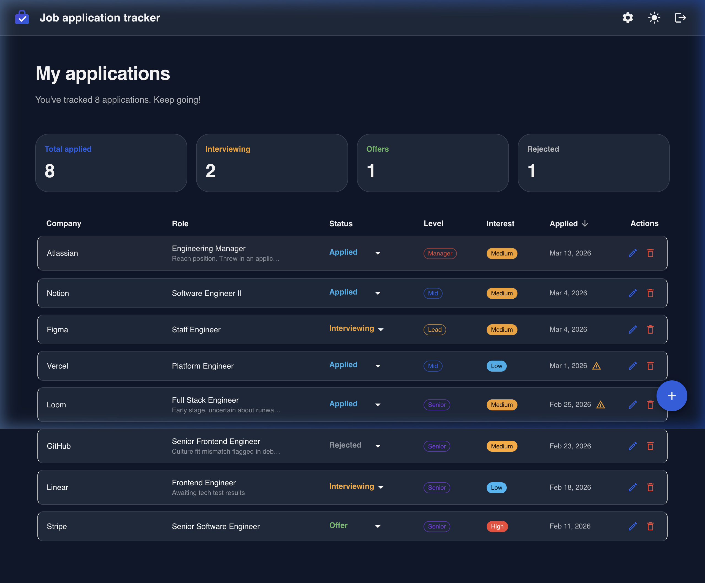
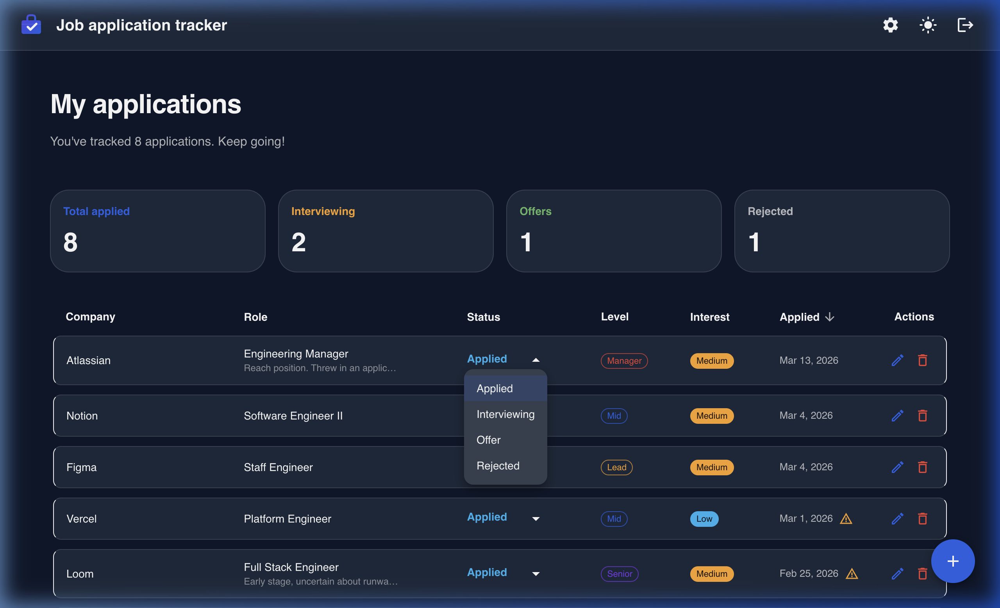

# Job Application Tracker

A full-stack web app for tracking job applications and interview progress — because spreadsheets just weren't cutting it anymore.

I built this as a personal project, using it as an opportunity to explore AI-assisted development with [Google Antigravity](https://antigravity.dev) and to use personally in my job hunt. The entire codebase was built iteratively through natural conversation — designing, debugging, and refining in real time.

## Screenshots

| Login | Dashboard |
|---|---|
|  |  |

| Add Application | Update Status |
|---|---|
|  |  |

## Features

- **Application tracking** — add, edit, and delete job applications with role, company, level, interest, notes, URL, and application date
- **Screenshot paste** — paste or drop a job posting screenshot into the add form to auto-populate details using AI
- **Status management** — update pipeline stage (Applied → Interviewing → Offer / Rejected) (A fun graphic shows at each transition)
- **Summary stats** — live dashboard cards show total applied, interviewing, offers, and rejections at a glance
- **Follow-up alerts** — warning indicator appears on any application stuck in "Applied" for 7+ days
- **Sortable table** — click any column header to sort by company, role, status, level, interest, or date
- **Dark / light mode** — toggle between themes, persisted across sessions
- **JWT auth** — secure per-user accounts with register, login, and logout

## Project Structure

npm workspaces monorepo:

```
├── frontend/    # React + Vite app (TypeScript, MUI)
├── backend/     # Express REST API + SQLite database (TypeScript)
└── package.json # Workspace root
```

## Getting Started

**1. Install dependencies:**
```bash
npm install
```

**2. Set up environment variables:**
```bash
# Frontend
cp frontend/.env.example frontend/.env

# Backend (required — server won't start without JWT_SECRET)
cp backend/.env.example backend/.env
```

**3. Start the backend** (Terminal 1):
```bash
npm run start:backend
```

**4. Start the frontend** (Terminal 2):
```bash
npm run dev
```

Open [http://localhost:5173](http://localhost:5173).

## Scripts

All run from the project root:

| Command | Description |
|---|---|
| `npm run dev` | Start the frontend dev server |
| `npm run start:backend` | Start the Express API server |
| `npm test` | Run all tests (frontend + backend) |
| `npm run test:watch` | Run frontend tests in watch mode |
| `npm run lint` | Lint the frontend |

## Tech Stack

| Layer | Tech |
|---|---|
| Frontend | React 19, TypeScript, Vite, MUI |
| Backend | Node.js, Express 5, TypeScript (tsx) |
| Database | SQLite |
| Auth | JWT + bcrypt |
| Testing | Vitest, Testing Library |
