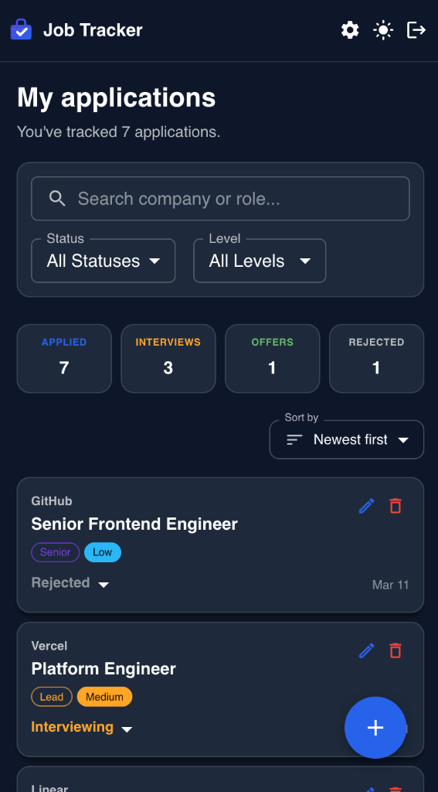
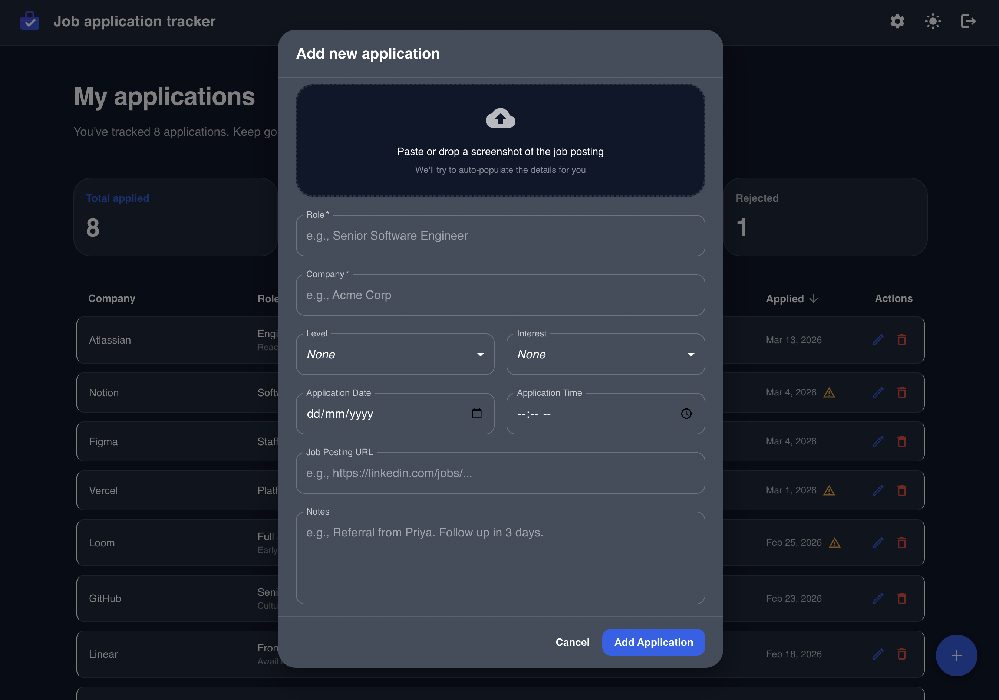
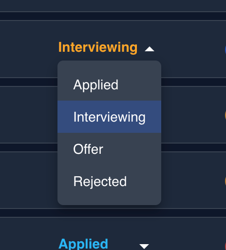
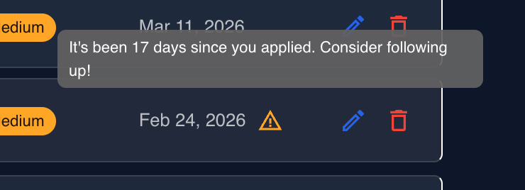
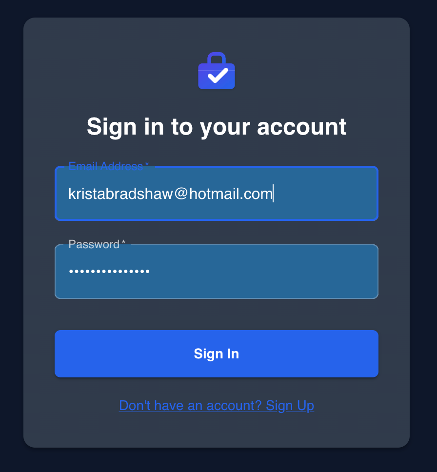

# Job Application Tracker

A full-stack web app for tracking job applications and interview progress — because spreadsheets just weren't cutting it anymore.

I built this as a personal project (and to genuinely help me in my job hunt), using it as an opportunity to explore AI-assisted development with [Google Antigravity](https://antigravity.dev). The entire codebase was built iteratively through natural conversation — designing, debugging, and refining in real time.

## Screenshots

| Dashboard (Desktop)                                                       | Dashboard (Mobile)                                                               | Add Application                                                             |
| ------------------------------------------------------------------------- | -------------------------------------------------------------------------------- | --------------------------------------------------------------------------- |
|  |  |  |

| Status Management                                                                   | Follow-up Alerts                                                                      | Authentication                                                         |
| ----------------------------------------------------------------------------------- | ------------------------------------------------------------------------------------- | ---------------------------------------------------------------------- |
|  |  |  |

## Features

- **Application tracking** — add, edit, and delete job applications with role, company, level, interest, notes, URL, and application date
- **Screenshot paste** — paste or drop a job posting screenshot into the add form to auto-populate details using AI
- **Status management** — update pipeline stage (Applied → Interviewing → Offer / Rejected) (A fun graphic shows at each transition)
- **Summary stats** — live dashboard cards show total applied, interviewing, offers, and rejections at a glance
- **Follow-up alerts** — warning indicator appears on any application stuck in "Applied" for 7+ days
- **Sortable table** — click any column header to sort by company, role, status, level, interest, or date
- **Dark / light mode** — toggle between themes, persisted across sessions
- **JWT auth** — secure per-user accounts with register, login, and logout
- **Mobile Responsive** — specialized card-based layout and navigation for mobile devices

## Project Structure

npm workspaces monorepo:

```
├── frontend/    # React + Vite app (TypeScript, MUI)
├── backend/     # Express REST API + SQLite database (TypeScript)
└── package.json # Workspace root
```

## Getting Started

**1. Install dependencies:**

```bash
npm install
```

**2. Set up environment variables:**

```bash
# Frontend
cp frontend/.env.example frontend/.env

# Backend (required — server won't start without JWT_SECRET)
cp backend/.env.example backend/.env
```

**3. Start the backend** (Terminal 1):

```bash
npm run start:backend
```

**4. Start the frontend** (Terminal 2):

```bash
npm run dev
```

Open [http://localhost:5173](http://localhost:5173).

---

## Mobile Use

This app is a **Progressive Web App (PWA)**, which means you can install it on your iPhone for a full-screen, native-like experience.

**1. Start the mobile-accessible server:**

```bash
npm run dev:mobile --prefix frontend
```

**2. Access on your iPhone:**
Open Safari and go to your computer's local IP address (e.g., `http://192.168.1.116:5173`).

> [!IMPORTANT]
> Make sure to use `http://` and NOT `https://`. Safari may try to default to HTTPS, which will cause a "Secure Connection" error.
> _Note: Both devices must be on the same Wi-Fi._

**3. Add to Home Screen:**

- Tap the **Share** button in Safari.
- Select **Add to Home Screen**.
- The "JobTracker" icon will now appear on your home screen!

## Scripts

All run from the project root:

| Command                 | Description                                               |
| ----------------------- | --------------------------------------------------------- |
| `npm run dev`           | Start the frontend dev server (localhost only)            |
| `npm run dev:mobile`    | Start the frontend dev server (accessible on local Wi-Fi) |
| `npm run start:backend` | Start the Express API server                              |
| `npm test`              | Run all tests (frontend + backend)                        |
| `npm run test:watch`    | Run frontend tests in watch mode                          |
| `npm run lint`          | Lint the frontend                                         |

## Tech Stack

| Layer    | Tech                            |
| -------- | ------------------------------- |
| Frontend | React 19, TypeScript, Vite, MUI |
| Backend  | Node.js, Express 5, TypeScript  |
| Database | SQLite                          |
| Auth     | JWT + bcrypt                    |
| Testing  | Vitest, Testing Library         |
| AI       | Gemini AI (optional)            |
